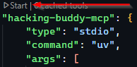
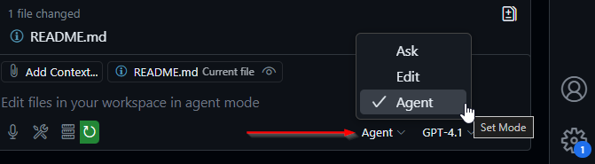

# Hacking Buddy MCP

**Hacking Buddy MCP** is a proof-of-concept project that explores how AI can be integrated into security operations, particularly within Red Team and Pentesting workflows. 

I created this tool to demonstrate practical ways in which AI can assist during offensive security engagements from reconnaissance and exploitation support to analyzing collected data. Since Red Teaming and Pentesting is where I spend most of my time, this project reflects both some of my hands-on experience and my interest in innovating with AI in the security space.

> Note: This project currently includes only a few integrated tools, but I plan to add more over time as I experiment with different scenarios. My goal is to keep it fun and iterative—sharing progress as I go instead of waiting to launch a fully built-out version later.
    
---    
## VSCode + GitHub Copilot
Hacking Buddy MCP is setup including the .vscode directory which contains the `mcp.json` file.
- You will need to adjust the `path` (the last argument) in the `mcp.json` to match your configuration.

---    
# Setup
## Pre-requisites
You need to have `uv` and dependencies (`FastMCP`) installed.

### Install uv:
```shell
curl -LsSf https://astral.sh/uv/install.sh | sh
```
See [uv installation guide](https://docs.astral.sh/uv/getting-started/installation/)

> ⚠️ It is highly recommended that you setup a virtual environment first!
> 1. Run `uv venv` to create a virtual environment
> 2. Run `source .venv/bin/activate` to active the virtual enviroment 

### Install dependencies from `pyproject.toml`
This allows you to automatically install the dependencies from a file. Run:
```shell
uv pip install -r pyproject.toml
```

### Install dependencies manually
#### Install FastMCP
```shell
uv pip install fastmcp
```
See the [FastMCP GitHub](https://github.com/jlowin/fastmcp).

---   
### Running the MCP server within VSCode
Running the MCP server is actually pretty easy:
1. In VSCode go to the mcp.json
2. Click Start above the JSON object, right above where it says "hacking-buddy-mcp"   
   
3. Open GitHub Copilot and change it's mode to **Agent**   
   
4. Ask it to perform one of the actions available from Hacking Buddy MCP Tools, like "Do an nmap discovery scan on this ip range 192.168.1.0/24" and "Run port scans on those hosts"
> ⚠ Note: If GitHub Copilot starts acting up you may need to start a new chat!

---    

> 🚧 This is an experimental project, feedback and ideas are always welcome!

---    
